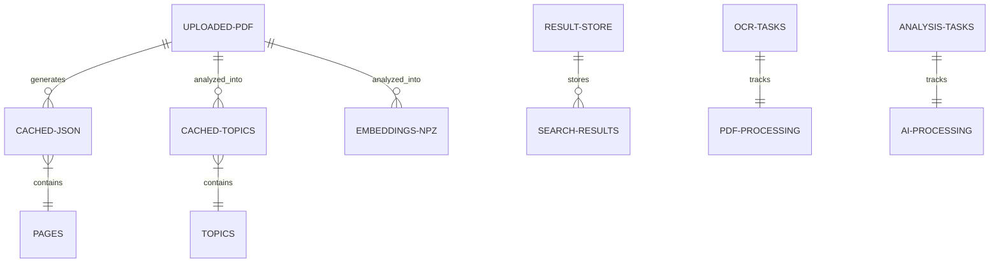
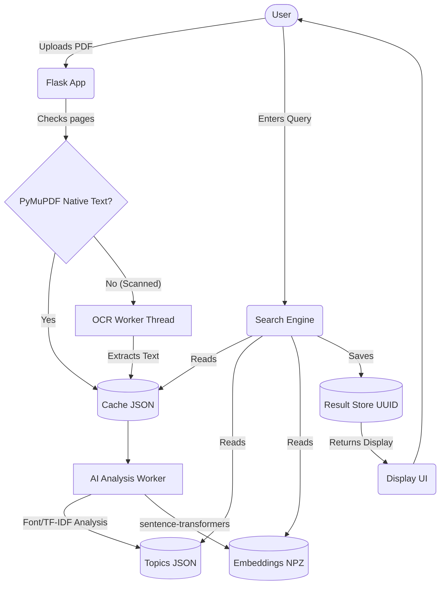
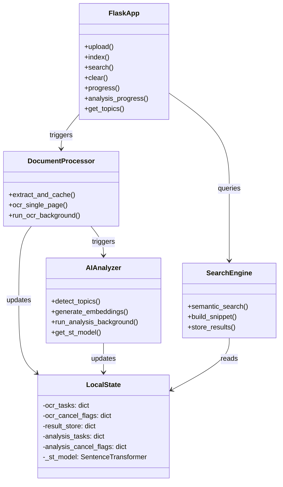
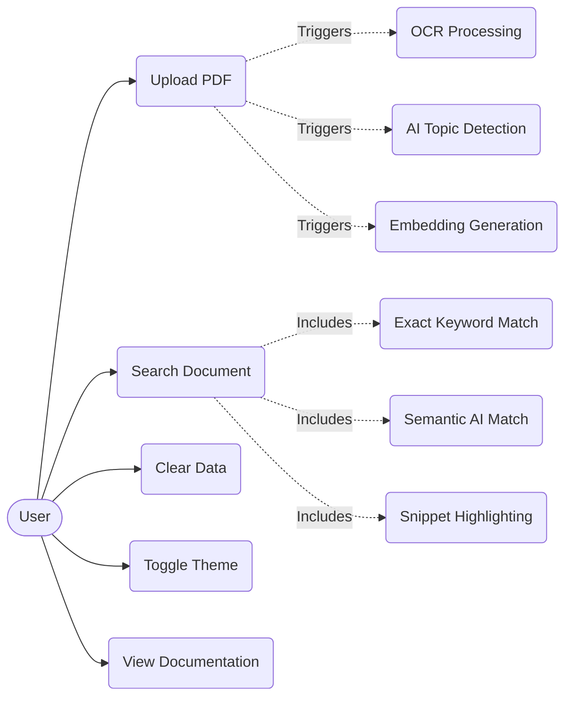
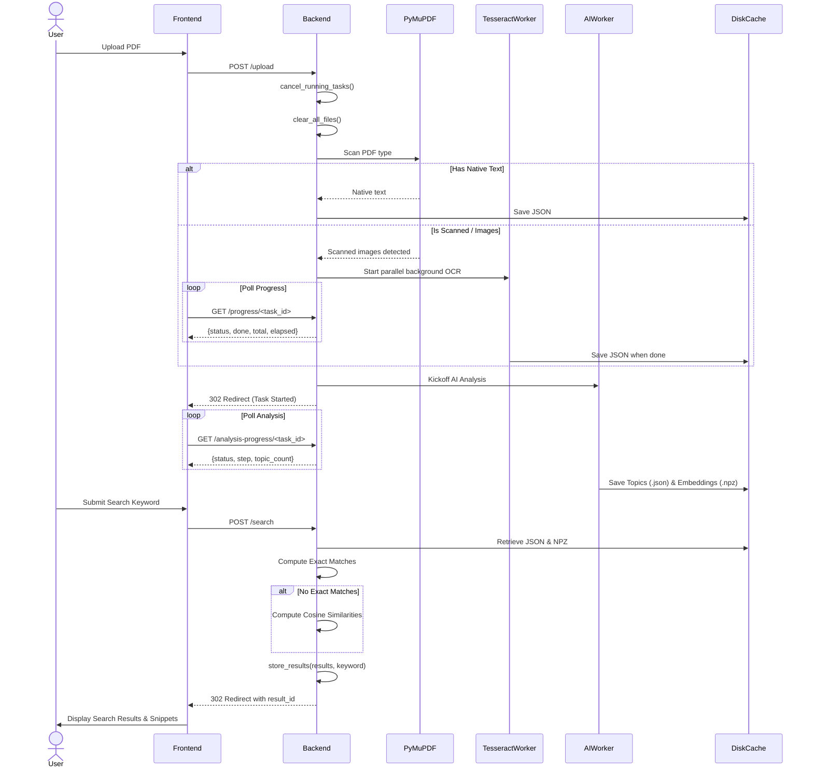
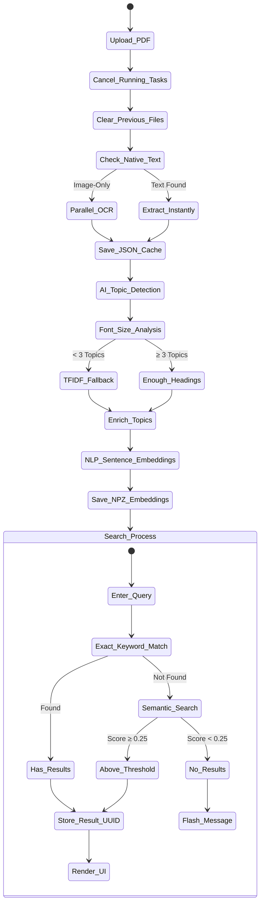
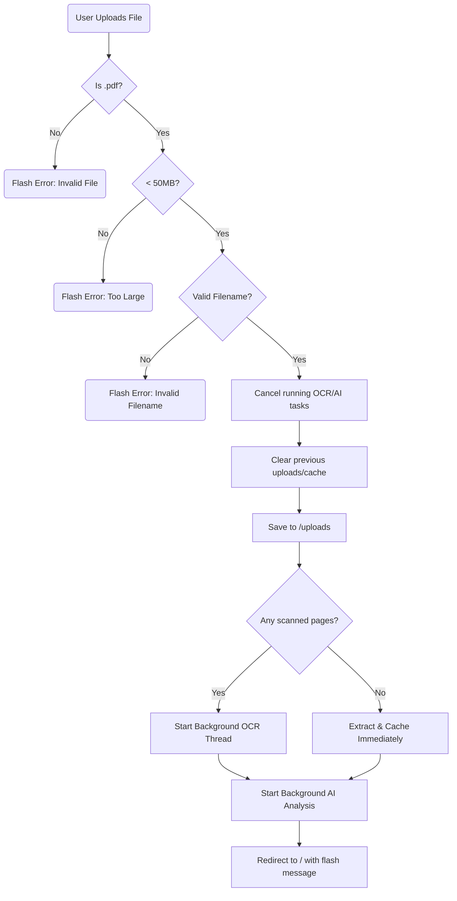
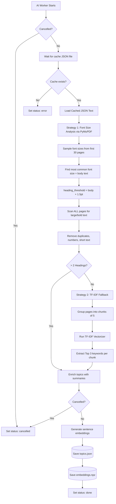
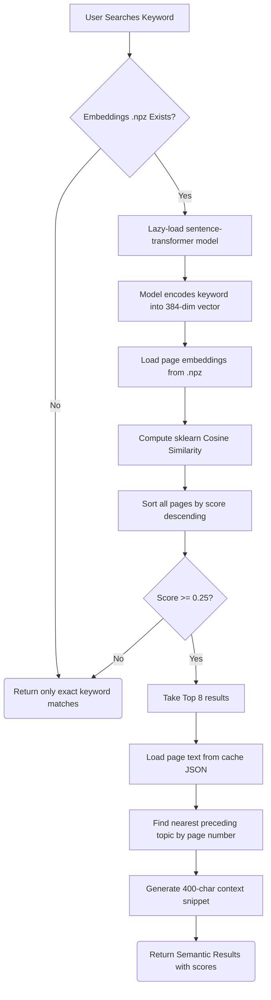
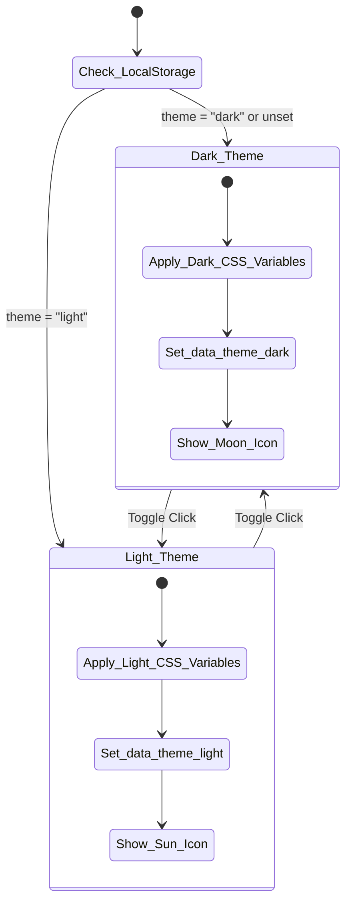

# 📄 Smart PDF Search Engine v2

A powerful, locally-hosted document intelligence and search application. This tool goes beyond basic text matching by integrating **Optical Character Recognition (OCR)**, **AI-Powered Semantic Search**, and **Intelligent Topic Detection** to help you extract insights from any PDF document—whether it's natively digital or a scanned image.


---

## 📌 Table of Contents

- [Key Features](#-key-features)
- [Screenshots & Demo](#-screenshots--demo)
- [Technology Stack](#️-technology-stack)
- [Project Architecture](#-project-architecture)
- [Getting Started](#-getting-started)
- [Usage Guide](#-usage-guide)
- [API Reference](#-api-reference)
- [Core Configuration](#️-core-configuration)
- [How It Works — Deep Dive](#-how-it-works--deep-dive)
- [System Diagrams](#-system-diagrams)
- [Performance & Optimization](#-performance--optimization)
- [Troubleshooting](#-troubleshooting)
- [Security & Privacy](#-security--privacy)
- [Contributing](#-contributing)
- [Changelog](#-changelog)
- [License](#-license)

---

## ✨ Key Features

### 🔍 Advanced Search Capabilities

| Feature | Description |
|---------|-------------|
| **Exact Keyword Search** | Instantly find specific terms across all pages with context-aware highlighted snippets. Case-insensitive matching with configurable context radius around each match. |
| **🧠 Semantic Search (v2)** | Powered by `sentence-transformers` (`all-MiniLM-L6-v2`), search queries are embedded into 384-dimensional vectors and compared against pre-computed page embeddings via cosine similarity. Finds contextually related content even when the exact keyword is absent. |
| **Hybrid Search Strategy** | Exact matches are returned first. If no exact matches exist, the engine automatically falls back to semantic search, surfacing the top 8 most relevant pages ranked by similarity score. |

### 📑 Intelligent Document Analysis

| Feature | Description |
|---------|-------------|
| **Font-Based Topic Detection** | Analyzes font sizes and weights across all pages via PyMuPDF's rich text extraction. Identifies headings by finding text rendered in fonts larger than the document's most common (body) font size by ≥1.5pt, or bolded text ≥0.5pt larger. |
| **TF-IDF Fallback** | If fewer than 3 structural headings are detected, the engine chunks pages into groups of 5 and runs a TF-IDF analysis (via `scikit-learn`). The top 3 keywords per chunk are extracted and formatted as topic labels, providing meaningful navigation even for unstructured documents. |
| **Topic Enrichment** | Each detected topic is enriched with a summary (first 2–3 sentences from the topic's page) and a text chunk for embedding, enabling downstream semantic operations. |

### 👁️ Robust OCR & PDF Parsing

| Feature | Description |
|---------|-------------|
| **Lightning Native Extraction** | Digital PDFs are parsed instantly using PyMuPDF (`fitz`). Each page's text is extracted in sequence and cached to disk as JSON. |
| **Scanned PDF Detection** | The engine automatically detects image-only pages (pages yielding no extractable text) and routes them to the OCR pipeline. |
| **Parallel OCR Processing** | Scanned pages are rendered to PNG at configurable DPI (default: 150) and processed through Tesseract OCR using `ThreadPoolExecutor` with up to 12 parallel workers. Pages are processed in batches of `2 × worker_count` to manage memory. |
| **Graceful Mid-OCR Cancellation** | Cancellation flags are checked at every stage—before rendering, between batches, and after each OCR result—enabling clean interruption without orphaned threads or corrupted cache. |

### ⚡ Performance & UX

| Feature | Description |
|---------|-------------|
| **Real-Time Progress Tracking** | Heavy OCR and AI embedding generation occurs in background threads. The frontend polls `/progress/<task_id>` and `/analysis-progress/<task_id>` endpoints to drive live progress bars and status indicators. |
| **Smart Local Caching** | Extracted text (`.json`), detected topics (`.topics.json`), and generated embeddings (`.npz`) are cached to disk. Subsequent searches and page loads are nearly instantaneous. |
| **Graceful Re-Upload** | Re-uploading a file instantly signals all running OCR and analysis tasks to cancel, clears previous files, and restarts the pipeline from scratch. |
| **Server-Side Result Storage** | Search results are stored server-side in a UUID-keyed dictionary with automatic LRU cleanup (oldest entries purged when exceeding 50 entries). This avoids the ~4KB browser cookie size limit. |
| **Dark & Light Themes** | Fully themed UI with CSS custom properties (`--bg-primary`, `--accent-primary`, etc.). Toggle persists via `localStorage`. Smooth transitions between themes using Bootstrap 5 and custom glassmorphism styles. |
| **100% Private** | Everything—including the ~90MB ML model—runs locally on your machine. Zero data leaves your computer. No external APIs, no telemetry, no cloud dependencies. |

---

## 🖼️ Screenshots & Demo

> Screenshots can be added here by placing images in a `screenshots/` folder:
>
> ```markdown
> 
> 
> 
> 
> ```

---

## 🛠️ Technology Stack

| Architecture Layer | Technologies Used | Purpose |
|--------------------|-------------------|---------|
| **Backend & Routing** | Flask 2.x, Werkzeug | HTTP request handling, file uploads, session management, JSON APIs |
| **PDF Processing** | PyMuPDF (fitz) | Native text extraction, font analysis, page rendering for OCR |
| **Optical Character Recognition** | Tesseract OCR, pytesseract, Pillow | Image-to-text conversion for scanned PDFs |
| **Machine Learning & NLP** | `sentence-transformers` (all-MiniLM-L6-v2), `scikit-learn` (TF-IDF, Cosine Similarity), `numpy` | Semantic embeddings, topic detection, similarity ranking |
| **Concurrency** | `threading`, `concurrent.futures.ThreadPoolExecutor` | Parallel OCR, background AI analysis |
| **Frontend** | HTML5, CSS3, Vanilla JS, Bootstrap 5, Bootstrap Icons, Google Fonts (Inter) | Responsive UI, glassmorphism design, theme toggle, progress bars |
| **Data Storage** | JSON files, NumPy `.npz` archives, in-memory dictionaries | Text cache, topic cache, embedding vectors, result sessions |

### Python Dependencies (Full List)

```
flask
PyMuPDF
pytesseract
Pillow
markupsafe
werkzeug
sentence-transformers
scikit-learn
numpy
```

---

## 📁 Project Architecture

```text
fileSrcEngine/
├── app.py                 # Application core: routing, background workers, AI logic (~970 lines)
│                          #   ├── Utility functions (clear_all_files, cancel_running_tasks, etc.)
│                          #   ├── Topic detection engine (detect_topics)
│                          #   ├── Embedding generator (generate_embeddings)
│                          #   ├── Background workers (run_ocr_background, run_analysis_background)
│                          #   ├── Semantic search engine (semantic_search)
│                          #   ├── Snippet builder (build_snippet)
│                          #   └── Flask routes (/, /upload, /search, /clear, /progress, etc.)
├── templates/
│   └── index.html         # Single-page responsive UI (~2000 lines)
│                          #   ├── CSS: Custom properties, glassmorphism, dark/light themes
│                          #   ├── Navbar with branding and theme toggle
│                          #   ├── Upload form with drag-and-drop support
│                          #   ├── Search interface with keyword input
│                          #   ├── Results display (exact matches + semantic results)
│                          #   ├── OCR & AI progress bar sections
│                          #   ├── Documentation accordion (How It Works)
│                          #   └── JavaScript: polling, progress tracking, theme persistence
├── static/                # Static assets directory (currently empty — CSS/JS inline in template)
├── uploads/               # Temporary storage for uploaded PDFs (git-ignored, auto-created)
├── cache/                 # Cached extracted text and topic analysis (git-ignored, auto-created)
│   ├── <filename>.json         # Extracted page text: {"filename": "...", "pages": [{page, text}]}
│   └── <filename>.topics.json  # Detected topics: [{title, page, summary}]
├── embeddings/            # Cached sentence-transformer vectors (git-ignored, auto-created)
│   └── <filename>.npz          # NumPy archive: page_embeddings, page_nums, topic_embeddings
├── temp/                  # Temporary processing files
├── venv/                  # Python virtual environment (git-ignored)
├── .gitignore             # Git ignore rules for runtime data
└── README.md              # This documentation file
```

### In-Memory Data Structures

The application maintains several server-side dictionaries to track state across asynchronous operations:

| Variable | Type | Purpose |
|----------|------|---------|
| `ocr_tasks` | `dict[str, dict]` | Tracks OCR task status, progress counts, timing, and errors |
| `ocr_cancel_flags` | `dict[str, bool]` | Signals running OCR workers to stop gracefully |
| `result_store` | `dict[str, dict]` | UUID-keyed search results with automatic LRU cleanup |
| `analysis_tasks` | `dict[str, dict]` | Tracks AI analysis status, step descriptions, and topic counts |
| `analysis_cancel_flags` | `dict[str, bool]` | Signals running AI analysis workers to cancel |
| `_st_model` | `SentenceTransformer` | Lazy-loaded, thread-safe singleton for the ML embedding model |

---

## 🚀 Getting Started

### 1. System Prerequisites

- **Python 3.8+** (3.10+ recommended for best performance)
- **Tesseract OCR** installed on your system (only required for scanned/image PDFs)
- **~90MB disk space** for the sentence-transformer model (auto-downloaded on first run)
- **~2GB RAM** recommended (model loading + concurrent OCR processing)

#### Installing Tesseract

<details>
<summary><strong>🪟 Windows</strong></summary>

1. Download the installer from [UB Mannheim Tesseract](https://github.com/UB-Mannheim/tesseract/wiki)
2. Install to the default path: `C:\Program Files\Tesseract-OCR\`
3. The application auto-detects this path. If installed elsewhere, update line 71 in `app.py`:
   ```python
   tesseract_path = r"C:\Program Files\Tesseract-OCR\tesseract.exe"
   ```
4. Verify installation:
   ```powershell
   & "C:\Program Files\Tesseract-OCR\tesseract.exe" --version
   ```

</details>

<details>
<summary><strong>🍎 macOS</strong></summary>

```bash
brew install tesseract
```

Verify:
```bash
tesseract --version
```

</details>

<details>
<summary><strong>🐧 Linux (Debian/Ubuntu)</strong></summary>

```bash
sudo apt update
sudo apt install tesseract-ocr
```

Verify:
```bash
tesseract --version
```

</details>

### 2. Installation

Clone the repository and navigate into the directory:
```bash
git clone <your-repo-url>
cd fileSrcEngine
```

Create and activate a virtual environment:
```bash
# Create virtual environment
python -m venv venv

# Activate (Windows)
venv\Scripts\activate

# Activate (macOS / Linux)
source venv/bin/activate
```

Install the required Python dependencies:
```bash
pip install flask PyMuPDF pytesseract Pillow markupsafe werkzeug sentence-transformers scikit-learn numpy
```

> **Note:** Running the app for the first time will automatically download the ~90MB `all-MiniLM-L6-v2` embedding model from Hugging Face. This is a one-time download.

### 3. Running the Application

Start the Flask development server:
```bash
python app.py
```

Expected console output:
```
 * Serving Flask app 'app'
 * Debug mode: on
 * Running on http://127.0.0.1:5000
```

Access the application in your browser:
```
http://127.0.0.1:5000
```

> **Important:** The `use_reloader=False` flag is set intentionally to prevent the Flask reloader from running `clear_all_files()` twice on startup.

### 4. Environment Variables

| Variable | Default | Description |
|----------|---------|-------------|
| `SECRET_KEY` | Random 24 bytes | Flask session signing key. Set this to a fixed value in production for session persistence across restarts. |

---

## 📖 Usage Guide

### Step 1: Upload a PDF

1. Click **"Choose File"** or drag and drop a `.pdf` file (up to 50MB).
2. Click the **Upload** button.
3. The engine immediately begins processing:

```
┌─────────────────────────────────────────────────────────────┐
│  Upload → Native Text Scan → OCR (if needed) → AI Analysis │
└─────────────────────────────────────────────────────────────┘
```

### Step 2: Processing Pipeline

The upload triggers a multi-stage pipeline:

| Stage | What Happens | Timing |
|-------|-------------|--------|
| **1. Native Scan** | PyMuPDF extracts text from all pages | Instant (~100ms for 100 pages) |
| **2. Scanned Detection** | Pages with no text are flagged for OCR | Instant |
| **3. OCR Processing** | Flagged pages are rendered → Tesseract OCR in parallel threads | ~1-5 sec/page depending on DPI and CPU |
| **4. Cache Write** | All extracted text saved as `cache/<filename>.json` | Instant |
| **5. Topic Detection** | Font-size analysis or TF-IDF keyword extraction | 1-5 seconds |
| **6. Embedding Generation** | `all-MiniLM-L6-v2` encodes all pages + topics into vectors | 2-10 seconds |
| **7. Embedding Cache** | Vectors saved as `embeddings/<filename>.npz` | Instant |

During stages 3 and 5-6, the UI displays real-time progress bars driven by AJAX polling.

### Step 3: Search

1. Enter a search query or keyword in the search input.
2. Press **Enter** or click the **Search** button.
3. Results appear in two possible forms:

**Exact Match Results:**
- Highlighted keyword snippets with 300 characters of surrounding context
- Page number and filename badges
- Results are scrollable in a dedicated container

**Semantic Results (AI Fallback):**
- When no exact keyword matches are found, the engine performs vector similarity search
- Results display similarity scores, topic titles, and text summaries
- Ranked by cosine similarity (descending), filtered by threshold ≥ 0.25

### Step 4: Clear Data

Click the **"Clear All Files"** button to:
- Cancel all running OCR and analysis tasks
- Delete all files from `uploads/`, `cache/`, and `embeddings/`
- Clear all in-memory task trackers and session data

---

## 📡 API Reference

All routes are defined in `app.py`. The application is a server-rendered Flask app with JSON polling endpoints.

### Pages (HTML Responses)

| Method | Route | Description |
|--------|-------|-------------|
| `GET` | `/` | Main page — renders upload form, search interface, results, and documentation |
| `POST` | `/upload` | Handles PDF file upload, triggers processing pipeline, redirects to `/` |
| `POST` | `/search` | Performs keyword search (exact + semantic), stores results server-side, redirects to `/` |
| `POST` | `/clear` | Cancels all tasks, clears all data, resets session, redirects to `/` |

### JSON Endpoints (AJAX Polling)

| Method | Route | Response Schema |
|--------|-------|-----------------|
| `GET` | `/progress/<task_id>` | `{"status": "running\|done\|cancelled\|error\|not_found", "done": int, "total": int, "error": str\|null, "elapsed": float}` |
| `GET` | `/analysis-progress/<task_id>` | `{"status": "running\|done\|pending\|cancelled\|error\|not_found", "step": str, "topic_count": int, "error": str\|null}` |
| `GET` | `/topics/<filename>` | `{"topics": [{"title": str, "page": int, "summary": str}], "status": "ok\|not_found"}` |

### Error Handling

| Scenario | HTTP Code | Behavior |
|----------|-----------|----------|
| File too large (>50MB) | 413 | Flash error message, redirect to `/` |
| Invalid file type | 200 | Flash error message, redirect to `/` |
| No file selected | 200 | Flash error message, redirect to `/` |
| Invalid/empty filename | 200 | Flash error message, redirect to `/` |
| Empty search query | 200 | Flash warning, redirect to `/` |
| No PDF uploaded yet | 200 | Flash warning, redirect to `/` |
| OCR processing error | 200 | Task status set to `"error"` with message |

---

## ⚙️ Core Configuration

All configuration is defined as constants at the top of `app.py`:

| Setting Variable | Default | Type | Description |
|------------------|---------|------|-------------|
| `MAX_CONTENT_LENGTH` | `50 * 1024 * 1024` (50 MB) | int | Maximum upload file size. Flask rejects requests exceeding this before the file is read. |
| `SNIPPET_RADIUS` | `300` | int | Number of characters displayed before and after the highlighted keyword in search results. |
| `OCR_DPI` | `150` | int | Render resolution for scanned PDF pages before OCR. Higher values improve accuracy but increase processing time and memory. |
| `MAX_RESULT_STORE` | `50` | int | Maximum number of search result sets stored server-side. When exceeded, the oldest 50% are purged. |
| `SEMANTIC_THRESHOLD` | `0.25` | float | Minimum cosine similarity score (0.0–1.0) for a semantic match to appear in results. Lower values show more results with lower relevance. |
| `MAX_SEMANTIC_RESULTS` | `8` | int | Maximum number of semantic search results returned per query. |
| `ALLOWED_EXTENSIONS` | `{".pdf"}` | set | Whitelist of accepted file extensions for upload. |

### Tesseract Configuration

On Windows, the application auto-configures the Tesseract path:
```python
if os.name == "nt":
    tesseract_path = r"C:\Program Files\Tesseract-OCR\tesseract.exe"
    if os.path.exists(tesseract_path):
        pytesseract.pytesseract.tesseract_cmd = tesseract_path
```

For non-standard installations, update this path in `app.py` (line 71).

### OCR Configuration

Tesseract is invoked with `--psm 6` (Page Segmentation Mode 6: "Assume a single uniform block of text"), which works well for typical document pages. To change this:
```python
# In ocr_single_page() function
text = pytesseract.image_to_string(img, config="--psm 6")
```

Available PSM modes: `0`=OSD only, `1`=Auto with OSD, `3`=Fully automatic, `4`=Single column, `6`=Single block (default), `11`=Sparse text, `13`=Raw line.

---

## 🔬 How It Works — Deep Dive

### 1. Text Extraction Pipeline

```
PDF Upload
    │
    ├── PyMuPDF opens the document
    │
    ├── For each page:
    │   ├── page.get_text() called
    │   ├── If text.strip() is non-empty → store as native text
    │   └── If text.strip() is empty → flag as "scanned"
    │
    ├── If ALL pages have native text:
    │   └── Save immediately to cache/<filename>.json
    │
    └── If ANY scanned pages detected:
        ├── Start background OCR thread
        ├── Render scanned pages to PNG at OCR_DPI resolution
        ├── Process in parallel batches via ThreadPoolExecutor
        ├── Each batch = 2 × cpu_count pages (max 24)
        ├── Each page → Tesseract OCR → extracted text
        ├── Check cancellation flags between each batch
        └── Merge native + OCR text → save to cache/<filename>.json
```

### 2. Topic Detection Algorithm

The engine uses a **two-strategy approach**:

**Strategy 1: Font-Size Heading Analysis**
```
1. Sample up to 30 pages for font size distribution
2. Count all font sizes → find the most common (= body text size)
3. Set heading_threshold = body_size + 1.5pt
4. Scan ALL pages for spans matching:
   - Font size ≥ heading_threshold, OR
   - Font size ≥ body_size + 0.5pt AND font is bold
5. Filter: length > 3 chars, length < 150 chars, not a page number
6. Deduplicate by normalized title
```

**Strategy 2: TF-IDF Keyword Extraction** (activated when Strategy 1 finds < 3 topics)
```
1. Group all pages into chunks of 5 consecutive pages
2. Concatenate text within each chunk
3. Run TfidfVectorizer(max_features=100, stop_words="english")
4. For each chunk: extract top 3 keywords by TF-IDF score
5. Format as "Section: Keyword1 / Keyword2 / Keyword3"
6. Associate with the first page number in the chunk
```

**Enrichment Step:**
```
For each topic:
1. Find the page text at topic.page
2. Split into sentences (regex: (?<=[.!?])\s+)
3. Select first 5 sentences, keep those > 20 chars, take top 3
4. Join as summary (max 400 chars)
5. Store first 1000 chars as text_chunk for embedding
```

### 3. Embedding Generation

```
Model: all-MiniLM-L6-v2 (384-dimensional vectors)
    │
    ├── Page Embeddings:
    │   ├── Each page text truncated to 1500 chars
    │   ├── Empty pages skipped
    │   └── model.encode(page_texts) → shape: (n_pages, 384)
    │
    ├── Topic Embeddings:
    │   ├── Each topic's text_chunk (or title fallback)
    │   └── model.encode(topic_texts) → shape: (n_topics, 384)
    │
    └── Saved as embeddings/<filename>.npz:
        ├── page_embeddings: ndarray (n_pages × 384)
        ├── page_nums: ndarray (n_pages,)
        └── topic_embeddings: ndarray (n_topics × 384)
```

### 4. Semantic Search Algorithm

```
Query: "machine learning fundamentals"
    │
    ├── Model encodes query → query_vector (1 × 384)
    │
    ├── Load embeddings/<filename>.npz
    │   └── page_embeddings (n_pages × 384)
    │
    ├── sklearn cosine_similarity(query_vector, page_embeddings)
    │   └── Returns similarity scores for each page (0.0 to 1.0)
    │
    ├── Sort pages by score (descending)
    │
    ├── Filter: score ≥ SEMANTIC_THRESHOLD (0.25)
    │
    ├── Take top MAX_SEMANTIC_RESULTS (8) pages
    │
    ├── For each result:
    │   ├── Load page text from cache JSON
    │   ├── Find the nearest preceding topic (by page number)
    │   ├── Build a 400-char snippet from the page
    │   └── Return: {filename, page, text, score, topic_title, topic_summary}
    │
    └── Return ranked results to frontend
```

### 5. Snippet Builder

The `build_snippet()` function creates highlighted context around keyword matches:

```
1. Find first occurrence of keyword (case-insensitive regex)
2. Extract text[match.start - 300 : match.end + 300]
3. Add "..." prefix/suffix if text was truncated
4. HTML-escape the snippet (XSS prevention)
5. Wrap all keyword occurrences with <mark>...</mark> tags
6. Convert newlines to <br> for HTML display
```

### 6. Background Task Management

The application uses a cooperative cancellation pattern:

```
Upload → cancel_running_tasks()
    │
    ├── Set ocr_cancel_flags[tid] = True for all running OCR tasks
    ├── Set analysis_cancel_flags[tid] = True for all running analysis tasks
    │
    ├── OCR Worker checks flag:
    │   ├── Before each batch render
    │   ├── During page rendering loop
    │   ├── Between OCR futures processing
    │   └── Before final cache write
    │
    └── Analysis Worker checks flag:
        ├── Before starting
        ├── During cache file polling loop
        ├── After topic detection
        ├── After embedding generation
        └── Before saving topics JSON
```

---

## 📊 System Diagrams

### 1. Entity-Relation Diagram (Data Structures)


### 2. Data Flow Diagram (DFD)


### 3. Module / Class Diagram


### 4. Use Case Diagram


### 5. Sequence Diagram


### 6. Activity Diagram


### 7. File Upload & Validation Flowchart


### 8. AI Topic Detection Flowchart


### 9. Semantic Search Ranking Flowchart


### 10. Theme Toggle & Frontend State Diagram


---

## 🚄 Performance & Optimization

### Benchmarks (Approximate)

| Operation | 10 Pages | 50 Pages | 200 Pages |
|-----------|----------|----------|-----------|
| Native text extraction | < 100ms | < 300ms | < 1s |
| OCR (150 DPI, 8 threads) | ~8s | ~40s | ~160s |
| Topic detection (fonts) | < 500ms | < 1s | < 3s |
| Embedding generation | ~1s | ~3s | ~10s |
| Keyword search (cached) | < 10ms | < 20ms | < 50ms |
| Semantic search | < 100ms | < 200ms | < 500ms |

### Tuning Tips

1. **Increase OCR speed:** Lower `OCR_DPI` from 150 to 100 (trades accuracy for speed).
2. **Reduce memory usage:** The `batch_size = max_workers * 2` in `run_ocr_background()` limits memory. Reduce the multiplier for memory-constrained systems.
3. **Improve semantic precision:** Increase `SEMANTIC_THRESHOLD` from 0.25 to 0.35+ for stricter relevance filtering.
4. **Extend snippet context:** Increase `SNIPPET_RADIUS` from 300 to 500 for more context in search results.
5. **Larger models:** Replace `all-MiniLM-L6-v2` with `all-mpnet-base-v2` (420MB, 768-dim) for ~5% better accuracy at the cost of speed and memory.

### Caching Strategy

The application uses a **process-once, read-many** caching strategy:

```
First upload of example.pdf:
  → uploads/example.pdf          (raw file)
  → cache/example.pdf.json       (extracted text, all pages)
  → cache/example.pdf.topics.json (detected topics)
  → embeddings/example.pdf.npz   (384-dim vectors)

Subsequent searches: read from cache only (no re-processing)
```

Clearing is all-or-nothing: the "Clear All Files" button purges all three directories. There is no per-file deletion.

---

## 🔧 Troubleshooting

### Common Issues

<details>
<summary><strong>❌ "TesseractNotFoundError" or "tesseract is not installed"</strong></summary>

**Cause:** Tesseract OCR is not installed or not at the expected path.

**Fix (Windows):**
1. Install from [UB Mannheim](https://github.com/UB-Mannheim/tesseract/wiki)
2. Ensure it's installed at `C:\Program Files\Tesseract-OCR\`
3. Or update the path in `app.py` line 71

**Fix (macOS/Linux):**
```bash
# macOS
brew install tesseract

# Ubuntu/Debian
sudo apt install tesseract-ocr
```

</details>

<details>
<summary><strong>❌ "No module named 'sentence_transformers'"</strong></summary>

**Cause:** The sentence-transformers package is not installed.

**Fix:**
```bash
pip install sentence-transformers
```
This will also install `torch` (~2GB) as a dependency.

</details>

<details>
<summary><strong>❌ First run is very slow</strong></summary>

**Cause:** The `all-MiniLM-L6-v2` model (~90MB) is being downloaded from Hugging Face on first use.

**Fix:** This is normal and only happens once. The model is cached locally in `~/.cache/huggingface/`.

</details>

<details>
<summary><strong>❌ "File is too large. Maximum upload size is 50 MB."</strong></summary>

**Cause:** The uploaded PDF exceeds the 50MB limit set by `MAX_CONTENT_LENGTH`.

**Fix:** Increase the limit in `app.py`:
```python
app.config["MAX_CONTENT_LENGTH"] = 100 * 1024 * 1024  # 100 MB
```

</details>

<details>
<summary><strong>❌ OCR produces garbled or incorrect text</strong></summary>

**Cause:** Low DPI rendering, complex page layouts, or non-English text.

**Fix:**
1. Increase `OCR_DPI` from 150 to 200 or 300
2. Change the PSM mode in `ocr_single_page()`:
   ```python
   text = pytesseract.image_to_string(img, config="--psm 3")  # Fully automatic
   ```
3. For non-English documents, add a language parameter:
   ```python
   text = pytesseract.image_to_string(img, lang="deu", config="--psm 6")  # German
   ```

</details>

<details>
<summary><strong>❌ Semantic search returns no results</strong></summary>

**Cause:** The AI analysis may not have completed yet, or the similarity threshold is too high.

**Fix:**
1. Wait for the AI analysis progress bar to complete
2. Check that `embeddings/<filename>.npz` exists
3. Lower `SEMANTIC_THRESHOLD` from 0.25 to 0.15

</details>

<details>
<summary><strong>❌ Application uses too much RAM</strong></summary>

**Cause:** The sentence-transformer model (~300MB in memory) + concurrent OCR processing.

**Fix:**
1. Reduce OCR workers: change `min(os.cpu_count() or 4, 12)` to a smaller number
2. Use a lighter model (would require code changes)
3. Process larger PDFs on a machine with ≥4GB RAM

</details>

---

## 🔐 Security & Privacy

### Data Privacy
- **100% local processing** — no data is sent to any external server
- **No API keys required** — the ML model runs entirely on-device
- **No telemetry or analytics** — the app does not phone home
- **Session data** uses Flask's signed cookie (HMAC-SHA256) — tamper-resistant but not encrypted

### Input Sanitization
- **Filenames** are sanitized using Werkzeug's `secure_filename()` to prevent path traversal and injection
- **Search keywords** and **snippets** are HTML-escaped using `markupsafe.escape()` to prevent XSS attacks
- **Highlighted matches** use regex substitution on already-escaped text

### Known Limitations
- The application runs Flask's **development server** — not suitable for production deployment without a WSGI server (e.g., Gunicorn, Waitress)
- The `SECRET_KEY` defaults to random bytes, meaning sessions are invalidated on restart. Set a fixed `SECRET_KEY` environment variable for persistence.
- **In-memory state** (task trackers, result store) is lost on server restart
- **Single-user architecture** — concurrent multi-user usage may cause race conditions on shared in-memory dictionaries
- File uploads are not virus-scanned

### Production Hardening Recommendations
1. Use a WSGI server: `waitress-serve --host 127.0.0.1 --port 5000 app:app`
2. Set a fixed `SECRET_KEY` environment variable
3. Add rate limiting (e.g., `flask-limiter`)
4. Deploy behind a reverse proxy (Nginx/Caddy) with HTTPS
5. Add file type validation beyond extension checking (magic bytes)

---

## 🤝 Contributing

Contributions are welcome! Here's how to get started:

### Development Setup

```bash
# Clone and enter the project
git clone <your-repo-url>
cd fileSrcEngine

# Create a virtual environment
python -m venv venv
venv\Scripts\activate   # Windows
source venv/bin/activate # macOS/Linux

# Install dependencies
pip install flask PyMuPDF pytesseract Pillow markupsafe werkzeug sentence-transformers scikit-learn numpy

# Run in development mode
python app.py
```

### Project Conventions

- **Single-file backend:** All server logic lives in `app.py`
- **Single-template frontend:** All UI lives in `templates/index.html` (CSS and JS inline)
- **No ORM/database:** Data stored as flat JSON files and NumPy archives
- **Cooperative cancellation:** Background tasks check boolean flags, never force-killed
- **Comment style:** Functions use docstrings; inline comments explain "why", not "what"

### Areas for Contribution

- [ ] Multi-file upload support
- [ ] Per-file deletion (instead of clear-all)
- [ ] Export search results as PDF/CSV
- [ ] Multi-language OCR support
- [ ] Persistent database (SQLite) for result history
- [ ] PDF viewer with in-page highlighting
- [ ] Docker containerization
- [ ] WebSocket-based progress updates (replace polling)
- [ ] Authentication and multi-user support

---

## 📋 Changelog

### v2.0 — Semantic Search & AI Analysis
- Added sentence-transformer based semantic search
- Added intelligent topic detection (font analysis + TF-IDF fallback)
- Added background AI analysis worker with progress tracking
- Added topic enrichment with page summaries
- Embedding vectors cached as `.npz` files

### v1.x — Core Search Engine
- PDF upload with native text extraction (PyMuPDF)
- Parallel OCR for scanned PDFs (Tesseract + ThreadPoolExecutor)
- Keyword search with highlighted snippets
- Real-time OCR progress tracking
- Server-side result storage (replacing cookie-based sessions)
- Cooperative OCR cancellation on re-upload
- Dark/Light theme toggle with glassmorphism UI
- Bootstrap 5 responsive design

---

## 📜 License

This project is open source and available under the [MIT License](LICENSE).

---

<div align="center">

**Smart PDF Search Engine v2**

Engineered with ❤️ using Flask, PyMuPDF, sentence-transformers, and Tesseract OCR.

[⬆ Back to Top](#-smart-pdf-search-engine-v2)

</div>
